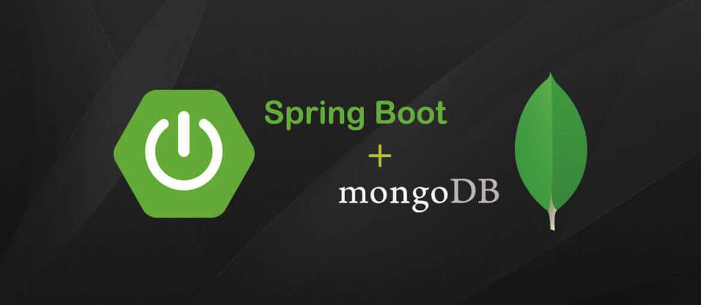

# spring-boot-mongodb
A Spring Boot project like a social media, with users posts and comments using the noSQL MongoDB.

# Motivation
That was one project of the course Java COMPLETO 2020 Programação Orientada a Objetos + Projetos, was really good do this project to use the knowledge that I obtained in the classes, helped to evolve my abilities and motivate me to study more about java and Spring Boot.

# Screenshots

# Tech/framework used
JDK - 11.0.7 and Spring Boot with Spring Tool Suit 4 and MongoDB

# Credits
That's the link for the course of my instructor: https://www.udemy.com/course/java-curso-completo/
